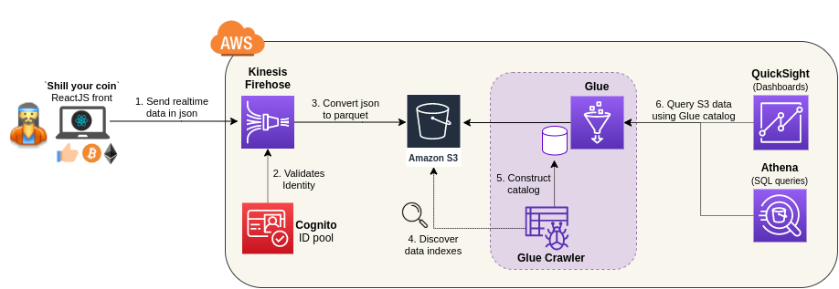
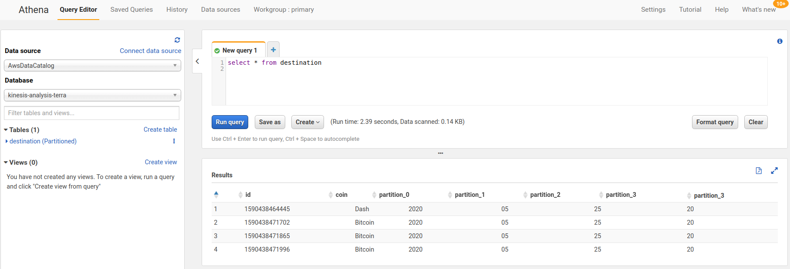

# Kinesis & Analytics: a simple serverless data pipeline

## Overview
This setup will deploy a data pipeline: a simple Reactjs voting app will send data to Kinesis Firehose, which will be store to S3. Then we will be able to query the data via a QuickSight dashboard (with the help of a Glue crawler). All components are managed services, so cost is low for our tests, and your don't have to maintain any servers nor clusters.

More info: you can find an overview of that setup on my [blog](https://greg.satoshi.tech/kinesis)

### Infra


- Cloud: AWS
- Front: ReactJs app `shill-your-coin`, that will generate dummy events (running locally)
- [Kinesis Firehose](https://aws.amazon.com/kinesis/data-firehose/): to inject realtime data (similar to Kafka), and store them to a S3
- [Cognito](https://aws.amazon.com/cognito/): our identity provider, it will authorize the user to send data to Firehose
- [S3](https://aws.amazon.com/s3): to easily store a huge amount of data
- [Glue](https://aws.amazon.com/glue): it will analyse your data in S3, make sense of them, and output metadata representing your data index in order to query them later (kind of a mapper, or catalogue)
- [Athena](https://aws.amazon.com/athena): with the index created by Glue, we can do SQL queries on our S3 data, in order to find patterns and create reports
- [QuickSight](https://aws.amazon.com/quicksight): same as Athena, it will use Glue and S3 data in order to create dashboards representing the data
- Code source: Github
- Deployment: [Terraform](https://www.terraform.io/) describes all components to be deployed. One command line will setup the infra

## Deploy

### Prerequisites
Please setup on your laptop:
- AWS cli and AWS account to deploy in `eu-west-1`

### Deploy to AWS
- Setup terraform vars
```
cd terraform
nano main.yml    <-- edit vars
```
- Deploy all the data pipeline components: 
```
terraform init
terraform apply
```

### Run the `shill-your-coin` app on your laptop
```
cd shill-your-coin
npm start
```
- Browse http://localhost:3000/ and click few times to generate events...
- Check that events are sent to kinesis (open browser devtool > network > `firehose.eu-west-1.amazonaws.com = 200`), 

## Checks

### Kinesis
- Check that data are pushed to Kinesis: `incomingBytes` (json)
- And few minutes later, that data are getting converted to parquet: `SucceedConversion`


### S3
- Check that 2 folders are created in S3: 
  - **Source**: with the raw json events
  - **Destination**: with the converted events in parquet


### Glue
- Open Glue. When the data appears in `destination` folder in S3, the crawler will run and detect the indexing of the data.


- Open Glue > Database > Table `destination`

- The crawler will display the resulting index. Your can confirm that it detected well the field `id`, `coin` and dates with the columns `partition_*`


### Athena
- Open Athena, select the Glue database and table and do the query below. Athena is using Glue catalog to make sense of the S3 data in order to query with SQL format


### Quicksight
- Finaly, open QuickSight to create a dashboard of the data.
- First click on <your user> > manage QuickSight > Security and Permission > Add > Athena + S3 > choose the right S3 buckets in details
- Then, New analysis > New dataset > Athena > Choose a name > create data source > select glue table `destination` > Directly query your data > Visualize
- Drop the field `coin` in the auto graph and choose a pie chart, you should see the following


### Destroy all
To delete all:
```
aws s3 rb s3://<YOUR-TAG> --force
cd terraform
terraform destroy
```
